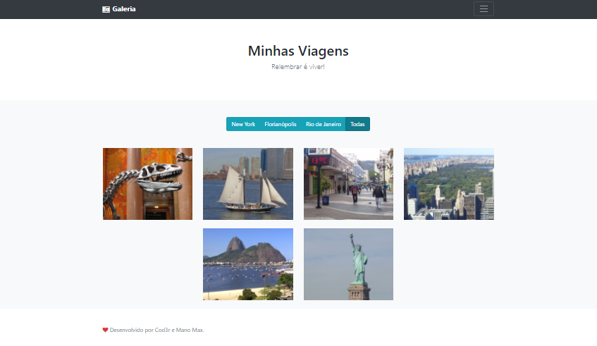

<h1> 📷 Photo Gallery </h1>

<h5>
  Course by: <a href="https://www.udemy.com/user/cod3r-3/">Cod3r Cursos Online</a> | Teacher: <a href="https://www.udemy.com/course/curso-web/#instructor-2">Leonardo Moura Leitao</a>
</h5>

<p>
  <h4>:clipboard: Sobre:</h4>
  
  Photo Gallery é um repositório de fotos pessoais, onde, seguindo um padrão de design baseado no site da <a href="https://getbootstrap.com/docs/5.0/examples/album/">Bootstrap</a>, podemos filtrar exibidas de acordo com a categoria selecionada.
</p>

____
<h4>:pushpin: Reprodução:</h4>



<h3> :game_die: Para rodar: </h3>

```bash
# Clone o repositório;
# Na pasta raiz do projeto, para instalar as dependências, digite o comando:
$ npm i

# Ainda na pasta raiz do projeto, para inicia-lo, digite o comando:
$ npm start

# Para utiliza-lo, basta acessar no navegador:
$ http://localhost:9000/
```

<p><i>
  
>*Author: [@ManoMax](https://github.com/ManoMax)*

</i></p>
